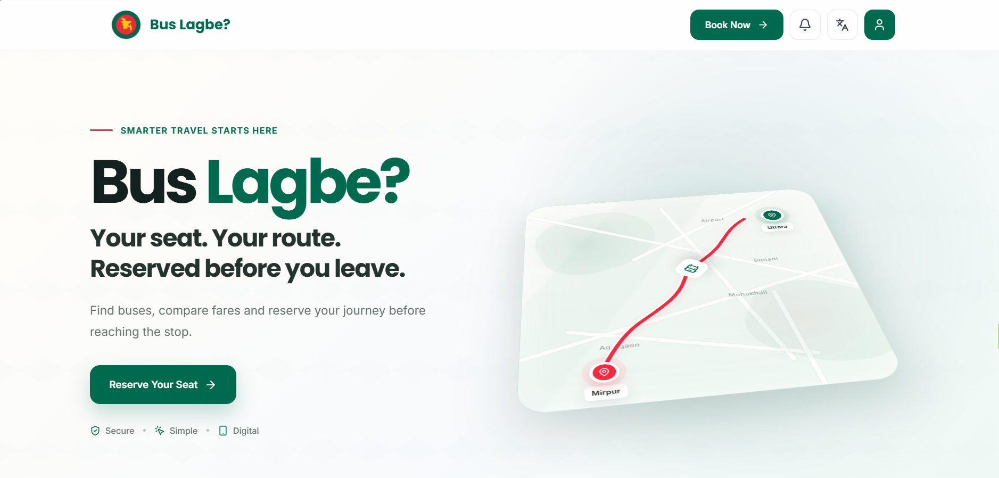
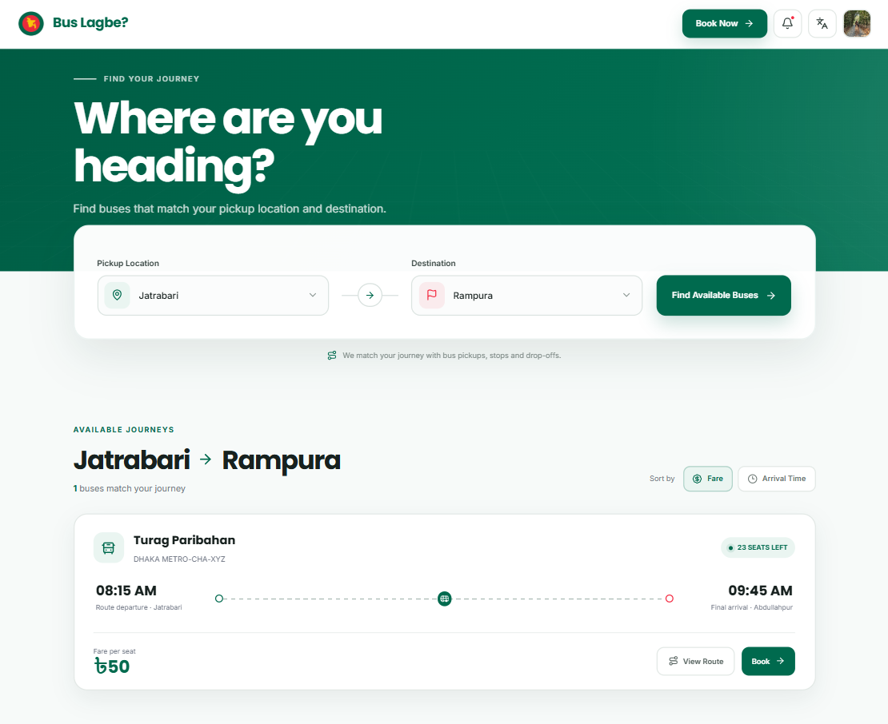
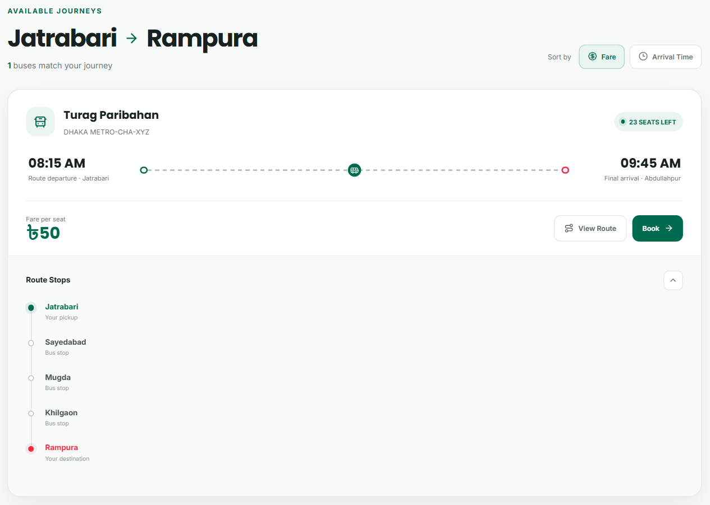
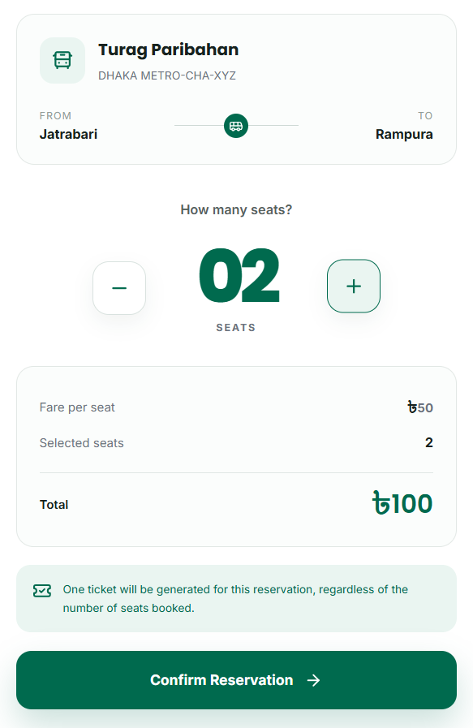
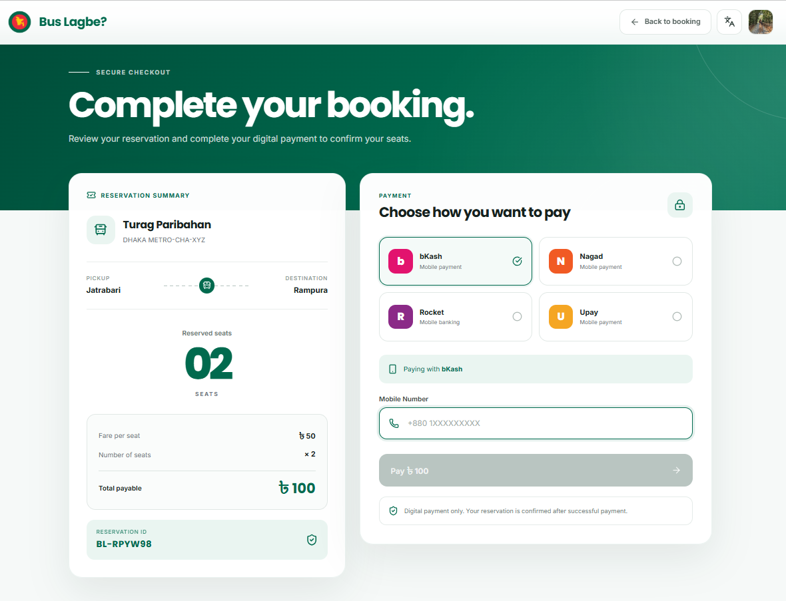
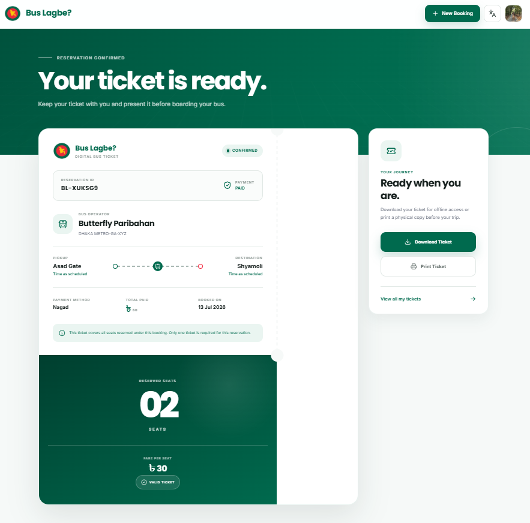

# 🇧🇩🚌 Bus Lagbe?

> **Your seat. Your route. Reserved before you leave.**

Bus Lagbe is a bilingual digital bus reservation platform designed around the realities of public and institutional transport in Bangladesh.

The platform allows passengers to search for buses based on their **pickup location and destination**, compare matching journeys, reserve multiple seats under a single reservation, complete a digital payment flow, and receive a downloadable ticket.

Rather than forcing users to search by bus operator first, Bus Lagbe uses **route-based matching** to identify buses whose pickup points, intermediate stops, and drop-off locations align with the passenger's journey.

🌐 **Live Prototype:** https://bus-lagbe.vercel.app/

---

## 📍 The Problem

Finding a bus in Bangladesh is often based on fragmented information, local knowledge, or physical presence at a bus stop.

For university and institutional transport, the problem can become even more inconvenient. Students may rush to buses early, ask friends to reserve seats, or leave personal belongings on seats simply to secure a place.

Existing digital ticketing systems largely focus on traditional intercity ticket purchases.

**Bus Lagbe explores a different question:**

> What if passengers could find and reserve a suitable bus based on where they are and where they need to go?

The goal is to make bus reservation **simple, route-aware, digital, and accessible**.

---

## ✨ Product Overview

<p align="center">
  
</p>

Bus Lagbe provides a complete prototype reservation journey from authentication to ticket generation.

Users can:

- Search using a pickup location and destination
- Discover buses whose routes match their journey
- Compare available bus operators and fares
- Inspect intermediate route stops
- Reserve one or multiple seats
- View dynamically calculated fares
- Select a digital payment provider
- Complete a simulated payment flow
- Receive one ticket for the entire reservation
- Download or print the generated ticket
- Access previous tickets and reservation history
- Receive booking and payment notifications

The platform is designed with **English and Bangla support in mind**, making the interface suitable for broader adoption in Bangladesh.

---

## 🗺️ Route-Based Bus Discovery

<p align="center">
  
</p>

The central feature of Bus Lagbe is its route-matching approach.

A passenger selects:

1. **Pickup Location**
2. **Destination**

The system then evaluates available bus route information and displays buses capable of serving the requested journey.

Bus data is currently retrieved from a structured CSV dataset containing information such as:

- Bus operator
- Registration number
- Pickup point
- Intermediate stops
- Drop-off location
- Departure time
- Arrival time
- Fare

Instead of showing every available bus, the platform filters the dataset to return **journey-relevant results**.

This approach makes the reservation experience more contextual to how passengers actually travel.

---

## 🚌 Compare Matching Journeys

<p align="center">
  
</p>

Matching buses are presented as individual journey cards, allowing passengers to quickly compare their available options.

Each result can display:

- Bus operator
- Bus registration number
- Departure time
- Estimated arrival time
- Fare per seat
- Available seats
- Route progression
- Intermediate bus stops

Passengers can also expand a journey to inspect its route before booking.

The interface clearly distinguishes:

- **Passenger pickup**
- **Intermediate stops**
- **Passenger destination**

This makes the matching logic transparent rather than presenting users with an unexplained search result.

---

## 🎟️ Multi-Seat Reservation

<p align="center">
  
</p>

Bus Lagbe supports multiple seats within a single reservation.

Passengers can increase or decrease the number of seats they want to reserve, while the total fare updates dynamically.

For example:

```text
Fare per seat: ৳50
Selected seats: 2
Total: ৳100
```

A key design decision is that **multiple tickets are not generated when multiple seats are booked**.

Instead:

> One reservation generates one ticket, regardless of the number of seats reserved.

The number of reserved seats is displayed prominently on the generated ticket, making the reservation easier to verify while avoiding unnecessary duplicate ticket generation.

---

## 💳 Digital Payment Flow

<p align="center">
  
</p>

Bus Lagbe is designed around digital payments.

The current prototype presents Bangladesh-focused mobile financial service options:

- bKash
- Nagad
- Rocket
- Upay

After selecting a payment provider, the passenger enters a valid Bangladeshi mobile number and proceeds through the payment interface.

The prototype currently uses a **simulated payment processing flow** rather than production payment gateway APIs.

Following a successful payment simulation, the system:

1. Confirms the reservation
2. Stores the reservation record
3. Updates the payment status
4. Generates the passenger's ticket
5. Creates reservation and payment notifications
6. Makes the ticket available through the user's account

The payment architecture is designed so that real payment gateway integrations can replace the demo flow in a production environment.

---

## 🎫 Digital Ticket Generation

After a successful reservation, Bus Lagbe generates an English digital ticket containing the relevant journey and payment information.

<p align="center">
  
</p>

Ticket information includes:

- Reservation ID
- Bus operator
- Bus registration number
- Pickup location
- Destination
- Journey time
- Number of reserved seats
- Total fare
- Payment status

The **number of seats is intentionally displayed prominently** because one ticket represents the complete reservation.

Passengers can:

- Download the ticket
- Print the ticket
- Access the ticket later through **My Tickets**

This creates a reusable reservation record instead of treating the ticket as a one-time confirmation screen.

---

## 👤 Passenger Account Experience

Bus Lagbe includes a connected passenger account experience.

### My Profile

Passengers can access and manage their account information through a dedicated profile interface.

### My Tickets

Confirmed tickets are stored and displayed for later access.

### Reservation History

Previous reservations can be reviewed through a dedicated history page.

### Notifications

The notification system provides updates for events such as:

- Reservation confirmation
- Successful payment
- Ticket availability

This allows the reservation flow to remain connected to the passenger's account after checkout.

---

## 🔐 Authentication

Bus Lagbe uses Firebase Authentication for the prototype authentication flow.

The platform supports:

- Account creation
- Login
- Google Sign-In
- Authenticated user sessions

The authentication interface was designed as both a **product introduction and login experience**, using a split-screen layout that introduces Bus Lagbe before users enter the main platform.

---

## 🧠 System Flow

```text
User Authentication
        ↓
Bus Lagbe Homepage
        ↓
Select Pickup Location
        ↓
Select Destination
        ↓
Route Matching
        ↓
Matching Buses Displayed
        ↓
Compare Fare, Time and Route
        ↓
Select Bus
        ↓
Choose Number of Seats
        ↓
Dynamic Fare Calculation
        ↓
Confirm Reservation
        ↓
Select Digital Payment Provider
        ↓
Payment Processing
        ↓
Reservation Confirmed
        ↓
Ticket Generated
        ↓
Download / Print / Access from My Tickets
```

---

## 🏗️ Current Prototype Architecture

Bus Lagbe is currently built as a lightweight web prototype using:

| Technology | Purpose |
|---|---|
| HTML5 | Page structure and semantic interfaces |
| CSS3 | Responsive UI and product styling |
| JavaScript | Reservation logic and interface interactions |
| Firebase | Authentication and Google Sign-In |
| CSV | Bus route and fare dataset |
| JSON / Web Storage | Prototype reservation and user state |
| Lucide | Interface icons |
| Vercel | Deployment |

The project intentionally uses a lightweight architecture for rapid prototyping and product validation.

---

## 💡 Why Bus Lagbe Is Different

Bus Lagbe is not designed only as another intercity ticket booking interface.

Its core idea is **route-aware seat reservation**.

The platform focuses on matching passengers to transport based on:

```text
Where are you?
        +
Where are you going?
        ↓
Which buses can actually serve your journey?
```

This model can potentially be adapted for transport environments where traditional ticketing systems are not enough.

---

## 🎓 SaaS Vision for University Transport

One of the strongest potential applications of Bus Lagbe is university transportation.

Students frequently face uncertainty around:

- Bus seat availability
- Route information
- Pickup points
- Demand during peak hours
- Informal seat reservation practices

Bus Lagbe can be adapted into a SaaS platform where universities manage their own transport network.

```text
University Transport System
        ↓
University Adds Buses and Routes
        ↓
Students Access Institution Portal
        ↓
Select Pickup and Destination
        ↓
View Matching University Buses
        ↓
Reserve Seat
        ↓
Receive Digital Reservation Pass
```

A university-facing dashboard could additionally provide transport administrators with:

- Route demand analytics
- Reservation volume
- Peak travel periods
- Bus utilization data
- High-demand pickup points
- Route planning insights

The same reservation engine used in the current prototype can therefore be extended into an **institutional transport management product**.

---

## 🚀 Future Development

Bus Lagbe is currently a functional prototype. Planned production-level improvements include:

- Full Bangla interface translation
- Firebase Firestore reservation storage
- User-specific cloud-based ticket history
- Real-time seat availability
- Production bKash payment gateway integration
- Production Nagad payment gateway integration
- University authentication and organization portals
- Transport operator dashboards
- Route demand analytics
- QR-based ticket verification
- Admin route management
- Live bus location tracking
- Mobile-first Progressive Web App support

---

## 🌍 Product Goal

Bus Lagbe was built around a simple idea:

> **Passengers should be able to reserve their journey before reaching the bus.**

The long-term goal is to explore a flexible reservation infrastructure that can serve public transport passengers, university students, and institution-managed transport networks in Bangladesh.

**Secure. Simple. Digital. Built for Bangladesh's transport network.**

---

## 👩‍💻 Developed By

**Najah Sadmim**  
BRAC University

GitHub: https://github.com/najahsadmim  
LinkedIn: https://www.linkedin.com/in/najahsadmim/

---

## 📄 License

This project is currently developed as a prototype and academic/personal software project.

© 2026 Najah Sadmim. All rights reserved.
